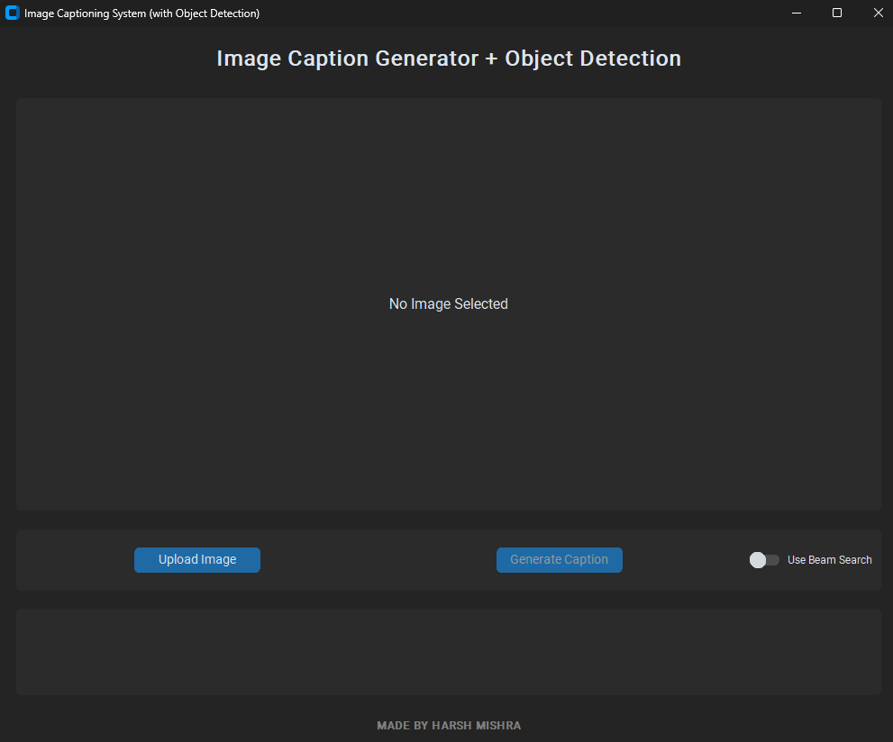
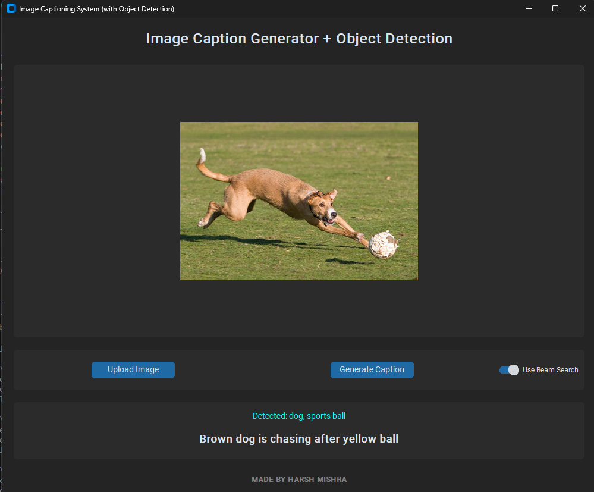

# 👁️ Image Captioning System with Object Detection


> **"A picture is worth a thousand words, but this AI tells you the right ones."**

**Author:** Harsh Mishra  
**Context:** Minor Project (3rd Semester)

---
## 📖 Overview

Bridging the gap between Computer Vision and Natural Language Processing (NLP), this project creates an intelligent system capable of "seeing" an image and describing it in natural language.

Unlike standard captioning models that rely solely on visual features, this system utilizes a **Dual-Input Architecture**. It combines the deep visual understanding of **VGG16** with the semantic object recognition of **YOLOv8**. This hybrid approach ensures that the generated captions are not just grammatically correct, but contextually rich and accurate.

To improve accuracy and context, the system integrates:
*   **VGG16**: For extracting visual features from images.
*   **YOLOv8**: For detecting specific objects (e.g., "person", "dog") to provide semantic context.
*   **Beam Search**: For generating more grammatically correct and coherent sentences compared to standard greedy search.

## Features
*   **Dual-Input Model**: Processes both image visual features and detected object tags.
*   **Object Detection**: Uses YOLOv8 to identify 80+ object classes.
*   **Beam Search Inference**: Toggle between fast (Greedy) and accurate (Beam Search) caption generation.
*   **Modern GUI**: Built with `customtkinter` for a sleek, dark-mode user interface.

---

## 📸 Project Screenshots

Here you can see the model in action through the CustomTkinter GUI.

### 1. The User Interface



### 2. Caption Generation Results




> **Note:** Screenshots are located in the `docs/screenshots/` folder.

---

## Installation

1.  **Clone the repository** (or download the source code).
2.  **Install dependencies**:
    ```bash
    pip install tensorflow pandas matplotlib scikit-learn tqdm pillow ultralytics customtkinter
    ```
3.  **Prepare Data**:
    *   Place Flickr8k images in `data/Images/`.
    *   Place `captions.txt` in `data/`.

## Usage

### 1. Running the GUI (Recommended)
The easiest way to use the project is via the Graphical User Interface.
```bash
python gui/app.py
```
*   **Upload Image**: Select an image from your computer.
*   **Generate Caption**: Click the button to see the result.
*   **Beam Search**: Toggle the switch to enable smarter caption generation.

### 2. Training the Model (Optional)
If you want to retrain the model from scratch:
```bash
python src/train.py
```
*   This will process images, extract features/objects, and train the model for 20 epochs.
*   The trained model will be saved to `models/model_final.keras`.

### 3. Object Extraction
To re-run object detection on all images:
```bash
python src/object_extractor.py
```
## 📂 Project Structure

The project is organized into modular directories for better maintainability:

```text
├── data/                  # Dataset storage (Input)
│   ├── Images/            # Source images (Flickr8k)
│   └── captions.txt       # Caption text data
├── models/                # Serialized models and binary files
│   ├── model_final.keras  # The trained deep learning model (VGG16 + LSTM)
│   ├── tokenizer.pkl      # Tokenizer object for text processing
│   ├── features.pkl       # Extracted visual features (VGG16)
│   └── objects.pkl        # Detected object tags (YOLOv8)
├── src/                   # Source code for backend logic
│   ├── train.py           # Main training script
│   ├── object_extractor.py# Script to run YOLOv8 object detection
│   └── utils.py           # Helper functions for data loading
├── gui/                   # Frontend Application
│   └── app.py             # Main executable for the Interface
├── docs/                  # Documentation assets
│   └── screenshots/       # Images used in this README
└── README.md              # Project documentation
```
## Credits
Developed by **Harsh Mishra**.
Based on the Flickr8k dataset.
